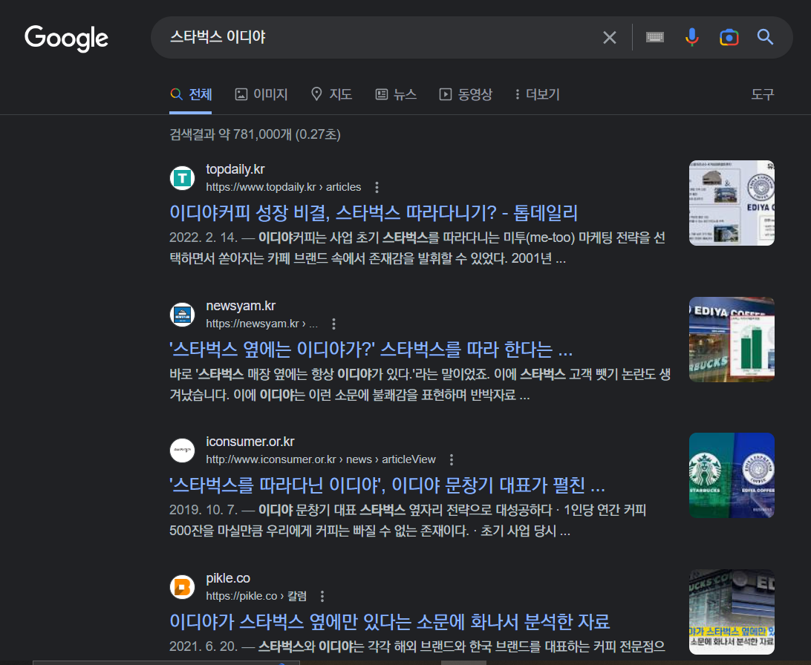

## 1. 문제 정의

아래 주장의 사실 여부를 파악하고자 한다

***"이디야는 스타벅스의 임점 위치를 따라 개점하는, 이른바 '스타벅스 옆자리 전략'으로 무임승차한다."***

### 세부 단계  
- 1.1. 자료 선정  

- 1.2. 자료 수집 및 요약

- 1.3. 결론
___
### 1.1. 문제 상황 관련 자료 선정

해당 문제는 2015년부터 현재까지 언급되는 주장이다   
**스타벅스 이디야**를 검색창에 입력하면 관련 게시물도 나온다.

주장이 참임을 가정하고 작성된 게시물과 그 반대의 경우를 확인할 수 있다.  

목표 설정을 위해 다음을 기준으로 자료를 수집·요약해 기존 주장을 확인하고자 한다.
1. 작성자와 작성 시기가 명확한 글 (뉴스기사 or 일관성 있게 작성된 개인 블로그) - **신뢰**할 수 있는 글
2. 주장과 근거가 있는 글 (수치에 기반하지 않더라도 차용) - **논리**가 있는 글
3. 입점 전략에 관한 글 (입점이 언급되지 않은 마케팅 전략은 제외) - **관련성**이 높은 글

___  
### 1.2. 관련 자료 수집 및 요약

<strong>References</strong>

1. 참 관련 자료
- https://www.speconomy.com/news/articleView.html?idxno=316421  
(스페셜경제, "이디야커피, 스타벅스 따라가면 성공한다(?), 2022년)  
- https://www.edaily.co.kr/news/read?newsId=01105366609365640   
(이데일리, "이디야의 필승 전략..'스타벅스 옆을 사수하라'", 2015년)  
- http://www.iconsumer.or.kr/news/articleView.html?idxno=10133  
(소비자평가, "‘스타벅스를 따라다닌 이디야’, 이디야 문창기 대표가 펼친 특별한 전략", 2019년)  
- https://m.blog.naver.com/PostView.naver?isHttpsRedirect=true&blogId=qaz030800&logNo=221680589189  
(네이버 블로그[작성자: 윈에이드], "유명기업의 마케팅전략: '이디야(EDIYA)커피' 편, 2019년)  
- https://m.blog.naver.com/urimmoe/222027146026  
(네이버 블로그[작성자: 로하스김], "커피전문점 이디야의 스타벅스 미투마케팅 전략", 2020년)  
- https://www.topdaily.kr/articles/90068  
 (톱데일리, "이디야커피 성장 비결, 스타벅스 따라다니기?", 2022년)  
 

2. 거짓 관련 자료  
- https://www.seoul.co.kr/news/newsView.php?id=20160919004005  
(서울신문, "스타벅스 vs 이디야, 매장 위치에 전략이 숨어 있다", 2016년)  
- https://brunch.co.kr/@tipoon1004/66  
(브런치[작성자: 권오은], "이디야는 스타벅스 옆을 떠난 걸까", 2017년)  
- https://www.insight.co.kr/news/194890  
(인사이트, "왜 스타벅스 옆에는 항상 토종 커피 브랜드 '이디야'가 있을까?", 2018년)  
- https://pikle.co/column/article/29709/  
(분당일보, "이디야가 스타벅스 옆에만 있다는 소문에 화나서 분석한 자료", 2021년) 

#### 1.2.1 참 관련 자료 요약 (총 6건)  
- 작성자 생활권에서 육안 관찰한 내용을 바탕으로 이디야의 입점 전략을 '미투 전략1'의 일환으로 설명
    - '실제로 ... 발견하는 것이 어렵지 않다' (2015년)  
    - '실제로 ... 떠올리거나 살펴보시기 바랍니다' (2020년)  
    - ' 지금도 스타벅스 매장 주변을 보면 ..." (2022년)  
 
- 관계자 언급  

    >  "브랜드 론칭 초기에는 ...(중략)... 스타벅스 옆을 노리는 전략을 펼쳤다" (2015년)

#### 1.2.2. 거짓 관련 자료 요약 (총 4건)
- 각 브랜드의 공개된 데이터(직접 수집 혹은 공공데이터)를 분석  
- 입점 전략 비교와 함꼐 관련 용어가 소개됨  
    - 스타벅스의 '허브 앤 스포크 전략2'  
    - 이디야의 '포인트 투 포인트 전략3'  
 
- 관계자 언급  

    > "사실 스타벅스는 옆은 임대료가 비싸서 ...(중략)... 이디야는 입점하기 힘들다" (2018년)  

___
### 1.3. 결론
참 관련 자료는 대체로 주장을 가정하고 작성되었으므로, 입증하는 자료로 보기는 어렵다.  
거짓 관련 자료는 데이터를 제시해 주장이 100% 참이 아닐 수 있음을 제시했다.  

하지만 2015년과 2018년 각각 다른 입장에 힘을 보태는 이디야 관계자의 언급,  
'실제로 이디야가 스타벅스 근처에 자주 보인다'는 무시할 수만은 없는 기사 작성자의 직관,  
기존 분석된 방법의 타당성 등을 면밀히 살펴 분석 목표를 좁혀야 한다.  